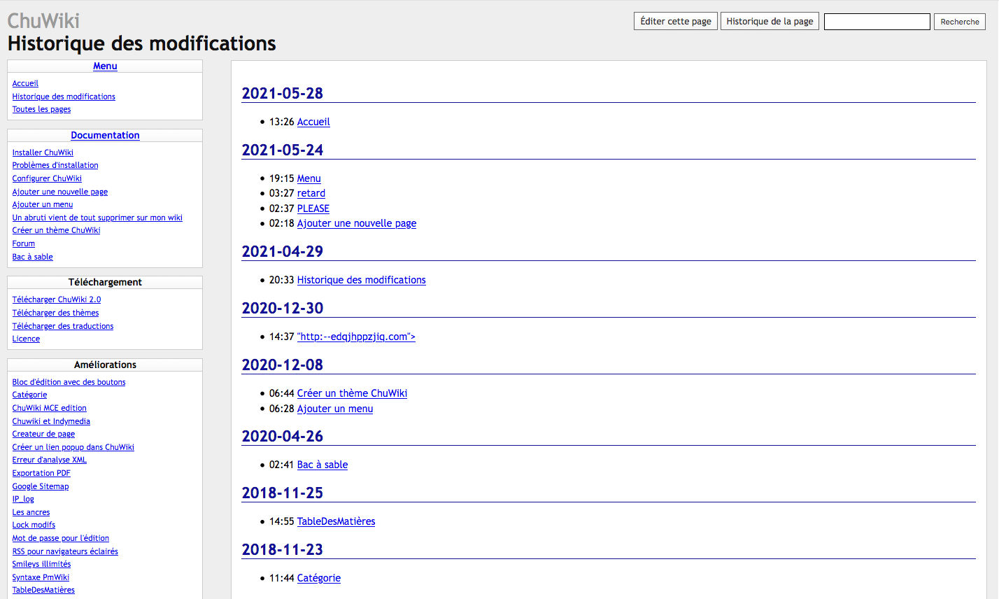

<!--
Este archivo README esta generado automaticamente<https://github.com/YunoHost/apps/tree/master/tools/readme_generator>
No se debe editar a mano.
-->

# ChuWiki para Yunohost

[](https://dash.yunohost.org/appci/app/chuwiki)  

[](https://install-app.yunohost.org/?app=chuwiki)

*[Leer este README en otros idiomas.](./ALL_README.md)*

> *Este paquete le permite instalarChuWiki rapidamente y simplement en un servidor YunoHost.*  
> *Si no tiene YunoHost, visita [the guide](https://yunohost.org/install) para aprender como instalarla.*

## Descripción general

ChuWiki is first and foremost a wiki. A wiki is a website whose pages can be edited by the visitor. However, a history system allows you to track modifications made to a page and restore an old version of the page if necessary.

**Versión actual:** 2.0~ynh3

**Demo:** <http://chuwiki.genezys.net/wiki/Bac%20%C3%A0%20sable>

## Capturas



## :red_circle: Características no deseables

- **Upstream not maintained**: This software is not maintained anymore. Expect it to break down over time, be exposed to unfixed security breaches, etc.

## Documentaciones y recursos

- Sitio web oficial: <http://chuwiki.genezys.net/>
- Documentación administrador oficial: <http://chuwiki.genezys.net/>
- Repositorio del código fuente oficial de la aplicación : <https://github.com/genezys/chuwiki>
- Catálogo YunoHost: <https://apps.yunohost.org/app/chuwiki>
- Reportar un error: <https://github.com/YunoHost-Apps/chuwiki_ynh/issues>

## Información para desarrolladores

Por favor enviar sus correcciones a la [`branch testing`](https://github.com/YunoHost-Apps/chuwiki_ynh/tree/testing

Para probar la rama `testing`, sigue asÍ:

```bash
sudo yunohost app install https://github.com/YunoHost-Apps/chuwiki_ynh/tree/testing --debug
o
sudo yunohost app upgrade chuwiki -u https://github.com/YunoHost-Apps/chuwiki_ynh/tree/testing --debug
```

**Mas informaciones sobre el empaquetado de aplicaciones:** <https://yunohost.org/packaging_apps>
